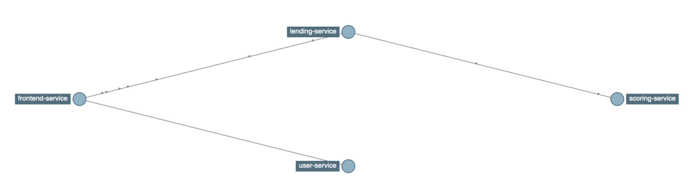

# Microservices implementation

This repository contains an example implementation of microservices for a fictional lending company.
I created this in 2018 when I was discussing as a potential employment to showcase what can be done with Java, Sprint-boot and GraphQL.

*As the code has been written in 2018 it doesn't use up-to-date dependencies but I share this in case it can be useful to someone.*

## Project structure

- the `microservices` directory contains a Spring-boot starter that configures common things used by all other microservices (like logging format, automatic propagation of authentication JWT token via Feign client, JSON parser configuration) and also a Gradle plugin (used by all microservices' `build.gradle` to setup common matters).
- the `scoring-service` directory contains a microservice that checks if a person can be given a loan or not (very simple implementation that checks if the monthly income is higher than a threshold).
- the `user-service` directory contains a service that manages user credentials. This is the service that contains the most documented code and APIs.
- the `lending-service` microservice manages the user lending account (currently only basic actions like withdraw and deposit) and uses `scoring-service` during the account opening procedure.
- `frontend-service` is a backend-for-frontend implementation that exposes data to the UI and also manages user sessions. It talks directly to `user-service` and `lending-service` and exposes a GraphQL interface.
- `ui` contains a React project for the web site.
- `generator-microservice` is a [Yeoman](http://yeoman.io) generator that creates new microservice projects ready to be run.

## Service dependencies

## Requirements

- a Redis instance run on port 6379 (see the script inside [docker/redis](docker/redis) to start one in docker).
- a Zipkin instance run on port 9411 (see the script inside [docker/zipkin](docker/zipkin) to start one in docker).
- an environment variable `MICROSERVICES_REPO_PATH` pointing to a directory in the local file system where to host an artifact repository.
